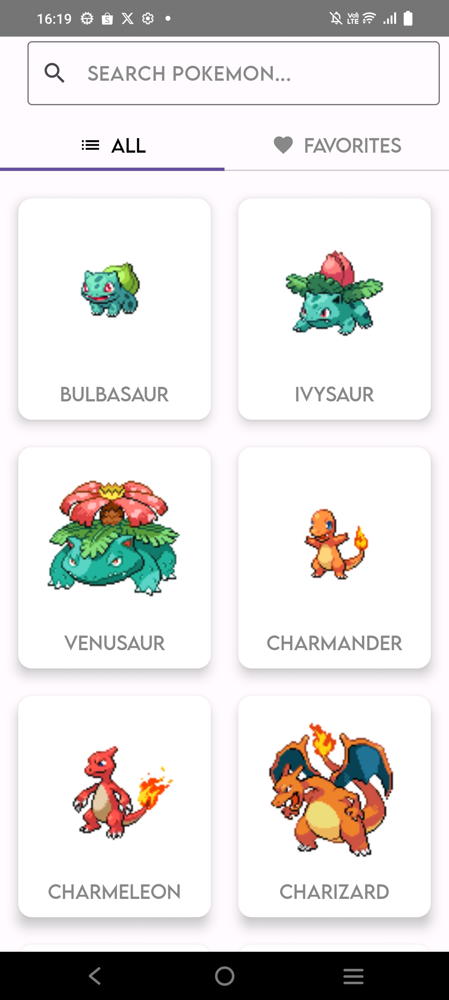
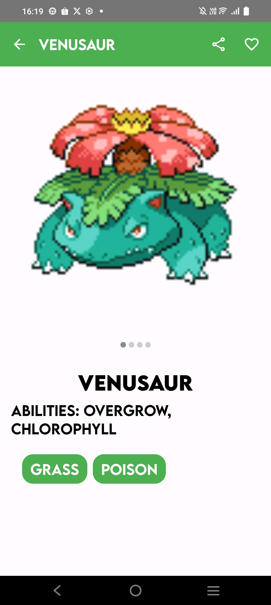
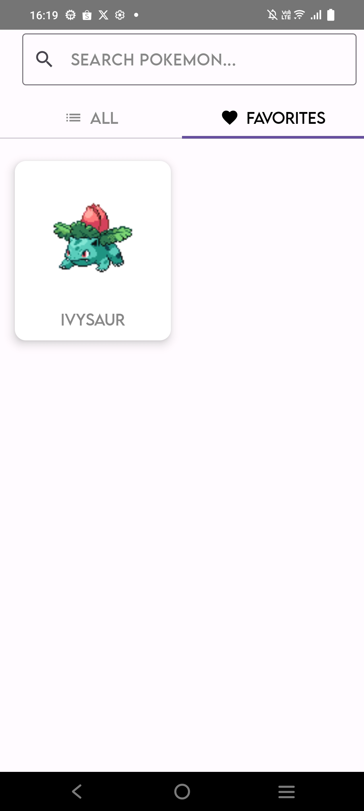
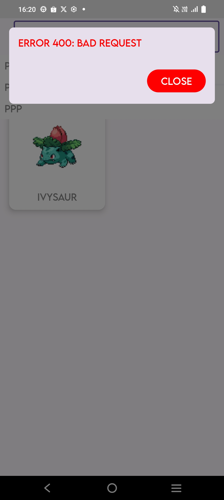

## 🧑‍🎤 Pokemon App

Esta es una aplicación de Pokémon que permite a los usuarios ver un listado de Pokémones y acceder a su detalle. Los usuarios pueden buscar Pokémones por su nombre y compartir su nombre y URL a través de otras aplicaciones, como WhatsApp. Además, se pueden agregar Pokémones a una lista de favoritos.

Si la aplicación no tiene conexión a internet, muestra una lista basada en búsquedas previas ingresadas por el usuario, y un popup simula un error 400 o 500 de manera aleatoria.

## 📱 Capturas de Pantalla

## 🛠️ Tecnologías utilizadas

- **Kotlin**: Lenguaje de programación principal.
- **Jetpack Compose**: Para el diseño de la UI de forma declarativa.
- **Navigation Component**: Manejo de la navegación entre pantallas.
- **Dagger Hilt**: Inyección de dependencias para una mejor modularidad.
- **Retrofit**: Para el consumo de APIs de manera eficiente.
- **Room**: Para la persistencia de datos locales y almacenamiento de favoritos.
- **MockK**: Para la creación de mocks en pruebas unitarias.

## 🏗️ Arquitectura MVVM

Se ha utilizado la arquitectura **MVVM (Model-View-ViewModel)** debido a sus múltiples ventajas:

- **Separación de responsabilidades**: La UI no maneja directamente la lógica de negocio, lo que facilita el mantenimiento y la escalabilidad.
- **Facilidad para realizar pruebas unitarias**: Al mantener la lógica de negocio en ViewModels, es más sencillo testear sin depender de la UI.
- **Reutilización de código**: ViewModels pueden ser utilizados en diferentes composables sin generar dependencias innecesarias.
- **Compatibilidad con Jetpack Compose**: MVVM se integra bien con `StateFlow` y `LiveData`, lo que permite una UI reactiva y eficiente.

## 🧪 Pruebas unitarias con MockK

Las pruebas unitarias se han desarrollado siguiendo el patrón **Given-When-Then**, lo que mejora la legibilidad y mantenimiento del código:

- **Given**: Se establece el estado inicial o las precondiciones de la prueba.
- **When**: Se ejecuta la acción que se desea testear.
- **Then**: Se verifican los resultados esperados.
